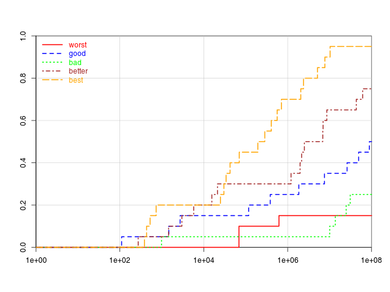

# An R Package with Utilities for Graphics and Plots

## 1. Introduction

In this package, we put some simple utilities for graphics and plots.
The main goal is to provide some wrapper around the `plot` function to make it easier to plot several data sets coming from a list (`batchPlot.list`) or a list of objects/lists (`batchPlot.groups`).
These plots then can automatically use distinctive colors.

## 2. Examples

### 2.1. `batchPlot.list`

This example showcases how data points can be plotted together with a function.

    library(plotteR)
    
    # set a random seed for replicability
    set.seed(1367);
    
    # make an example
    make.example <- function(f) {
      n <- as.integer(round(runif(n=1, min=10, max=200)));
      x <- sort(runif(n=n, min=0, max=3)); # generate x data
      y <- rnorm(n=n, mean=f(x), s=0.1);  # noisy y
      x <- rnorm(n=n, mean=x, s=0.1); # noisy x
      return(list(x=x, y=y, f=f));
    }
    
    # the three base functions
    f <- c(function(x) 1 - 0.2*x + 0.75*x*x - 0.3*x*x*x,
           function(x) 0.1 * exp(3 - x),
           function(x) 1.2 + 0.7*sin(2*x));
    
    # create the three example data sets
    examples <- lapply(X=f, FUN=make.example);
    
    # plot the original data
    batchPlot.list(examples,
                   names=c("f1", "f2", "f3"),
                   main="Original Data and Function Values for x",
                   legend=list(x="bottom", horiz=TRUE));

### 2.2. `batchPlot.list` with Curve Extension and Non-Finite Point Fixing

We can automatically add some `x`-coordinates to the function plots.
If a function takes on non-finite values within the range of the axis, we automatically try to fix the corresponding `x` coordinates to the closest finite matches.

    library(plotteR)
    
    # set a random seed for replicability
    set.seed(1367);
    
    # make an example
    make.example <- function(f) {
      suppressWarnings({
        repeat {
          n <- as.integer(round(runif(n=1, min=10, max=20)));
          x <- sort(runif(n=n, min=-5, max=5)); # generate x data
          y <- rnorm(n=n, mean=f(x), s=0.1);  # noisy y
          x <- rnorm(n=n, mean=x, s=0.1); # noisy x
          fi <- is.finite(x) & is.finite(y);
          x <- x[fi];
          if(length(x) > 4L) {
            y <- y[fi];
            return(list(x=x, y=y, f=f));
          }
        }
      });
    }
    
    # the three base functions
    f <- c(function(x) 1 - 0.2*x + 0.75*x*x - 0.3*x*x*x,
           log,   # this function becomes non-finite for x <= 0
           asin); # non-finite for any x outside of [-1, 1]
    
    # create the three example data sets
    examples <- lapply(X=f, FUN=make.example);
    
    old <- par(mfcol=c(2, 1));
    
    # plot the original data, which only covers part of the x.axis
    batchPlot.list(examples,
                   names=c("f1", "f2", "f3"),
                   main="Original Data and Function Values for x",
                   legend=list(x="left"),
                   y.min.lower = -3,
                   y.max.upper= 3);
    abline(v=-1, col="gray");abline(v=0, col="gray");abline(v=1, col="gray");
    
    
    # extending the function lines towards their smallest and largest finite
    # points
    batchPlot.list(examples,
                   names=c("f1", "f2", "f3"),
                   main="Functions Extented by Finite Point Search",
                   legend=list(x="left"),
                   y.min.lower = -3,
                   y.max.upper= 3,
                   x.add = TRUE);
    abline(v=-1, col="gray");abline(v=0, col="gray");abline(v=1, col="gray");
    
    par(old);

### 2.3. `batchPlot.groups`

We can also have groups of functions which share the same color.

We can also plot groups of similar data easily.

    library(plotteR)
    
    # set a random seed for replicability
    set.seed(2677);
    
    # the three base functions with the mean parameter values
    f <- list(
      list(f=function(x, par) par[1] + par[2]*x + par[3]*x*x + par[4]*x*x*x,
           m=c(1, -0.2, 0.75, -0.3)),
      list(f = function(x, par) par[1] * exp(par[2] - x),
           m=c(0.1, 3)),
      list(f=function(x, par) par[1] + par[2]*sin(par[3]*x),
           m=c(0, 1, 3)));
    
    # create the three example data sets
    examples <- lapply(X=f, FUN=function(example) {
    # for each example function, plot 4 to 50 instances
      lapply(seq_len(runif(n=1, min=4, max=50)),
    # for each instance
             FUN=function(i) {
    # randomly choose the x-coordinates
               x <- runif(n=as.integer(round(runif(n=1, min=10, max=200))),
                          min=0, max=3);
               m <- example$m;
    # pick parameters which are normally distributed around the suggestion
               par <- rnorm(n=length(m), mean=m, s=0.1*abs(m));
    # and construct a function
               fff <- function(x) example$f(x, par);
    # and pass this function as result example together with the x values
               list(x=x, f=fff)
             })
    });
    
    # plot the original data
    batchPlot.groups(examples,
                     names=c("f1", "f2", "f3"),
                     main="Several Groups of Functions",
                     plotXY=FALSE, plotXF=TRUE,
                     legend=list(x="bottom", horiz=TRUE));

### 2.3. 3D Scatter Plots with `batchPlot.3d`

With the function `batchPlot.3d`, we can create 3-dimensional scatter plots of multiple datasets.
For a given dataset, we can plot the points directly and/or try to interpolate them to a surface.
The latter is, by default, based on kriging, but you can replace the modeling mechanism with anything, even with the direct computation of a function. In this case, you are not interpolating but directly plotting a 3-dimensional function.

    library(plotteR)
    
    # set a random seed for replicability
    set.seed(1000L);
    
    # generate the first example dataset
    f1 <- function(x, y) (x*x - y*y);
    x1 <- runif(n=400, min=-2, max=2);
    y1 <- runif(n=400, min=-2, max=2);
    z1 <- f1(x1, y1);
    d1 <- list(x=x1, y=y1, z=z1);
    
    # generate the second example dataset
    f2 <- function(x, y) 0.8*x + 0.25*y - 7;
    x2 <- runif(n=400, min=-2, max=2);
    y2 <- runif(n=400, min=-2, max=2);
    z2 <- rnorm(n=400, mean=f2(x2, y2), sd=0.1);
    d2 <- list(x=x2, y=y2, z=z2);
    
    # plot the data together with the interpolated surfaces
    batchPlot.3d(list(d1, d2), plotPoints=TRUE, legend=c("f1", "f2"), legendWidth =0.1);
    
    readline("Press return to continue")
    
    # now we just plot the actual surfaces for comparison.
    d1$f <- f1;
    d2$f <- f2;
    batchPlot.3d(list(d1, d2), plotPoints=FALSE, legend=c("f1", "f2"),
                 model=function(d) d$f,
                 predict=function(m, x, y) m(x, y), legendWidth =0.1);

Below you can find the two resulting plots.

### 2.6 Gantt Charts

With `plot.gantt`, we can plot simple Gantt charts, i.e., diagrams that can visualize assignments of tasks to workers or jobs.

    plot.gantt(list(
      list( list(job=11L,start=0L,end=68L),
            list(job=0L,start=83L,end=155L),
            list(job=8L,start=155L,end=194L),
            list(job=14L,start=250L,end=297L),
            list(job=1L,start=297L,end=320L),
            list(job=9L,start=320L,end=340L)
      ),
      list( list(job=3L,start=0L,end=68L),
            list(job=2L,start=68L,end=118L),
            list(job=12L,start=211L,end=271L)
      ),
      list( list(job=14L,start=0L,end=24L),
            list(job=13L,start=45L,end=137L),
            list(job=6L,start=137L,end=228L),
            list(job=4L,start=228L,end=262L)
      ),
      list( list(job=2L,start=118L,end=211L),
            list(job=1L,start=211L,end=254L),
            list(job=11L,start=254L,end=314L)
      ),
      list( list(job=8L,start=0L,end=35L),
            list(job=13L,start=35L,end=45L),
            list(job=3L,start=135L,end=234L),
            list(job=0L,start=234L,end=264L),
            list(job=2L,start=291L,end=308L)
      ),
      list( list(job=14L,start=24L,end=53L),
            list(job=13L,start=137L,end=160L),
            list(job=2L,start=211L,end=291L)
      ),
      list( list(job=1L,start=0L,end=19L),
            list(job=6L,start=19L,end=90L),
            list(job=0L,start=155L,end=229L),
            list(job=3L,start=234L,end=294L),
            list(job=13L,start=294L,end=340L)
      ),
      list( list(job=0L,start=0L,end=8L),
            list(job=4L,start=8L,end=92L),
            list(job=3L,start=92L,end=135L),
            list(job=7L,start=135L,end=225L),
            list(job=10L,start=225L,end=324L)
      ),
      list( list(job=5L,start=0L,end=60L),
            list(job=7L,start=60L,end=122L),
            list(job=1L,start=122L,end=195L),
            list(job=14L,start=195L,end=250L),
            list(job=6L,start=250L,end=315L)
      ),
      list( list(job=0L,start=8L,end=83L),
            list(job=14L,start=83L,end=132L),
            list(job=12L,start=132L,end=211L),
            list(job=9L,start=211L,end=269L),
            list(job=8L,start=269L,end=343L)
      )
    ), main="Gantt Chart", prefix.job="");

### 2.5. Empirical Cumulative Distribution Functions (ECDFs)

With `plot.ecdf`, you can plot Empirical Cumulative Distribution Functions (ECDFs). These are functions where a fraction of successes is plotted over a time axis. We often use those in optimization, e.g., to display how many of the independent runs of an experiment have solved a given problem until a certain point in time.

    set.seed(10000L);
    time.max.pow <- 8;
    
    # create a single run, where the quality dimension reaches to end
    make.run <- function(end) {
      repeat {
        x <- sort(unique(as.integer(runif(n=20L, min=1L, max=(10^(runif(n=1L, min=2, max=time.max.pow)))))));
        if(length(x) == 20L) { break; }
      }
      repeat {
        y <- sort(unique(c(end, runif(n=19L, min=end, max=500))), decreasing=TRUE);
        if(length(y) == 20L) {
          break;
        }
      }
      return(matrix(c(x, y), ncol=2L))
    }
    
    # make n runs where m reach below 0, i.e., whose ECDF reaches m/n
    make.runs <- function(n, m) {
      return(lapply(X=seq_len(n),
                    FUN=function(i) {
                      if(i <= m) { end <- runif(n=1L, min=-10L, max=0L); }
                      else       { end <- runif(n=1L, min=1L, max=100L); }
                      return(make.run(end));
                    }))
    }
    
    # plot five example ECDFs, where the end results reach 3/20, 10/20, 5/20, 15/20,
    # and 19/20, respectively
    plot.ecdf(x = list(make.runs(20, 3),
                       make.runs(20, 10),
                       make.runs(20, 5),
                       make.runs(20, 15),
                       make.runs(20, 19)),
              names=c("worst", "good", "bad", "better", "best"),
              time.markers=c(1e2, 1e4, 1e6, 1e8),
              log="x",
              time.max=(10^time.max.pow));

### 2.6. `colors.distinct` and `plot.colors`

All of our plotting tools use the `colors.distinct` method by default to generate its palette (unless told otherwise via, e.g., the `colors` parameters). The goal of `colors.distinct(n)` is to generate `n` colors which should be visually distinct. Of course, there may exist other, better methods than doing this, but for our purposes here, it is sufficient. Below, you can find the first 36 palettes generated by the current version, i.e., the results of `colors.distinct(n)` for `n` in `1...20`.

You can plot a palette `x` of `length(x)=i` colors using `plot.colors`.
This function will create graphics like the one above, where a line of each color touches a line with every color. This way, you can see whether the colors actually look distinct or whether there are some lines which seem to blend with each other.

## 3. Installation

You can install the package directl from GitHub by using the package
[`devtools`](http://cran.r-project.org/web/packages/devtools/index.html) as
follows:

    library(devtools)
    install_github("thomasWeise/plotteR")

If `devtools` is not yet installed on your machine, you need to FIRST do

    install.packages("devtools")

## 4. License

The copyright holder of this package is Prof. Dr. Thomas Weise (see Contact).
The package is licensed under the  GNU LESSER GENERAL PUBLIC LICENSE Version 3, 29 June 2007.

## 5. Contact

If you have any questions or suggestions, please contact
[Prof. Dr. Thomas Weise](http://iao.hfuu.edu.cn/team/director) of the
[Institute of Applied Optimization](http://iao.hfuu.edu.cn/) at
[Hefei University](http://www.hfuu.edu.cn) in
Hefei, Anhui, China via
email to [tweise@hfuu.edu.cn](mailto:tweise@hfuu.edu.cn).
